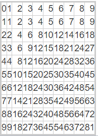

# 九九乘法表

## 只使用PHP

    for ($i = 0; $i < 10; $i++){
        for ($j = 0; $j < 10; $j++){
            if ($i == 0){
                echo sprintf("%d ", ($i + 1) * $j);
            } else if ($j == 0){
                echo sprintf("%d ",  $i * ($j + 1));
            } else {
                echo  sprintf("%d ", $i * $j);
            }
        }
        echo "\n";
    }

### 輸出
    0 1 2 3 4 5 6 7 8 9 
    1 1 2 3 4 5 6 7 8 9 
    2 2 4 6 8 10 12 14 16 18 
    3 3 6 9 12 15 18 21 24 27 
    4 4 8 12 16 20 24 28 32 36 
    5 5 10 15 20 25 30 35 40 45 
    6 6 12 18 24 30 36 42 48 54 
    7 7 14 21 28 35 42 49 56 63 
    8 8 16 24 32 40 48 56 64 72 
    9 9 18 27 36 45 54 63 72 81 
---
## 加入html的table
    <body>
        <table  style="border:3px #cccccc solid; text-align:right" cellpadding="10" border='1' >
            <?php
            for ($i = 0; $i < 10; $i++){
                ?>
                    <tr><?php
                for ($j = 0; $j < 10; $j++){ ?>
                    <td><?php 
                    if ($i == 0){
                        echo sprintf("%d", ($i + 1) * $j);
                    } else if ($j == 0){
                        echo sprintf("%d",  $i * ($j + 1));
                    } else {
                        echo  sprintf("%d", $i * $j);
                    }?> </td> <?php 
                }
                ?> </tr> <?php 
                
            }
            ?>
        </table>
    </body>

### 輸出

  
> 